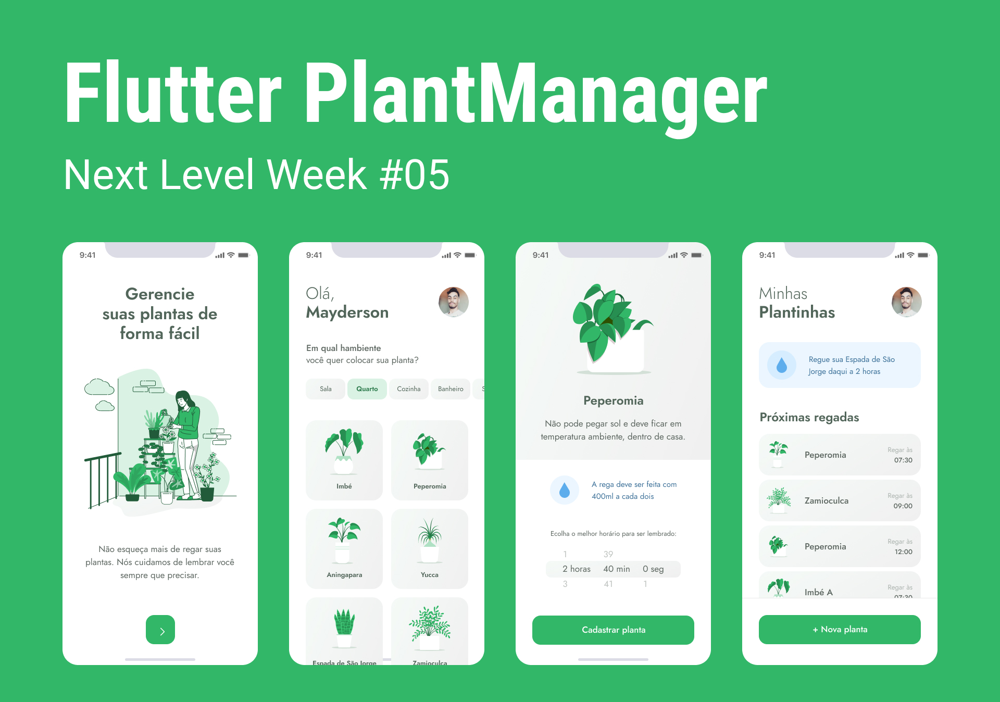

<h1 align="center">
  
</h1>

<p align="center">
  <a href="#-technologies">Technologies</a>&nbsp;&nbsp;&nbsp;|&nbsp;&nbsp;&nbsp;
  <a href="#-project">Project</a>&nbsp;&nbsp;&nbsp;|&nbsp;&nbsp;&nbsp;
  <a href="#-layout">Layout</a>&nbsp;&nbsp;&nbsp;|&nbsp;&nbsp;&nbsp;
  <a href="#memo-license">License</a>
</p>

<br />

<p align="center">
  
</p>

## 🚀 Technologies

This project was developed with the following technologies:

- [Flutter](http://flutter.dev)

## 💻 Project

Plant Manager is an application that was developed on Rocketseat NLW5 with React Native but was rebuilt using Flutter.

## 🔖 Layout

In the links below you will find the layout of the web project.

- [Layout Web](https://www.figma.com/file/zmCjko14YTjqx78ccto4DG/PlantManager)

## Getting Started

First, install all dependencies and run app with your emulator:

```bash
# Install dependencies
flutter pub get

# Run app on android emulator
adb reverse tcp:3000 tcp:3000
flutter run -d emulator-5554
```

> emulator-5554 is a example, get name of your emulator with command: flutter devices

Now install globally json-server on your system

```bash
npm install -g json-server
# or
yarn global add json-server
```

Run fake api

```bash
json-server --watch server.json -p 3000 -d 2000
```

## :memo: License

This project is under the MIT license. See the file [LICENSE](LICENSE) for more details.